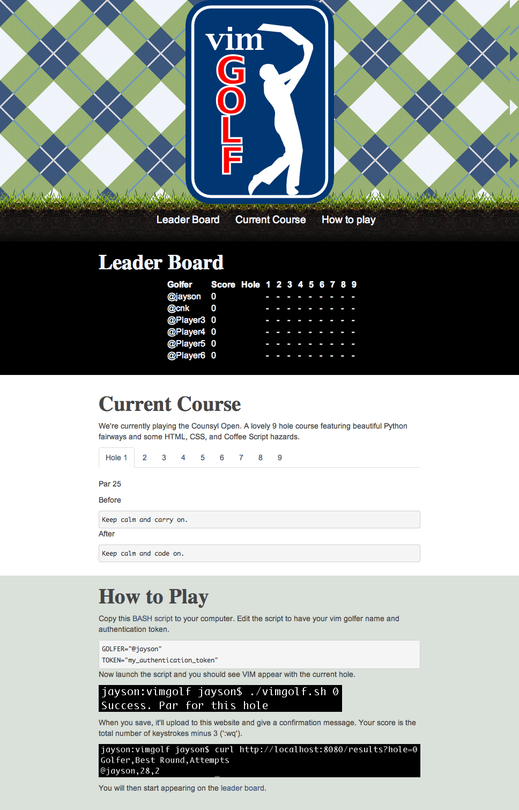

vim golf
=======

This vim golf implementation is a fun side project for devs to play at Counsyl. Anyone can use it. The code is designed to be run on an Amazon ECC instance. I'm unsure if those instructions are in this source code. If not, I'll add them.

- Jayson

